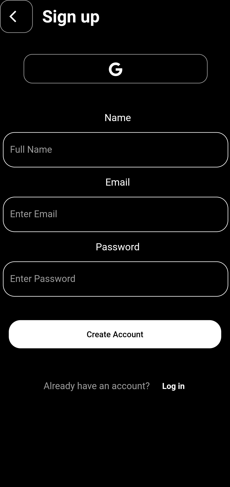
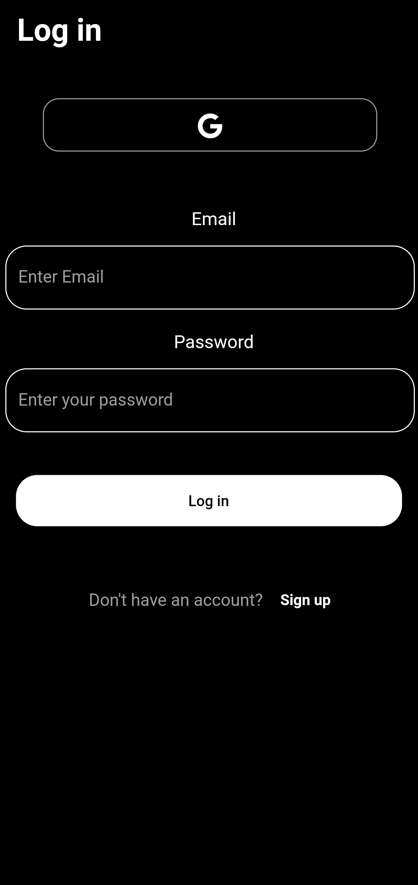

# Clean Archtecture

A simple app to shows login signup. App built with Bloc architecture using  GetIt, Dart, Providers, Google signin.
Google sign in is pending for approved with Google maybe not word as expected.

 

    
    

 

## The app has following layers:
1. **core**: Contains generic implemtation of other layers.
1. **data**: It contains all the data accessing, repositories and manipulating components.
2. **injection_container**: Dependency providing classes using GetIt.
3. **domain**: It contains entities, usecase or repositories.
4. **presentation**:Bloc and repective UI screens.
#### Classes have been designed in such a way that it could be inherited and maximize the code reuse.
 

